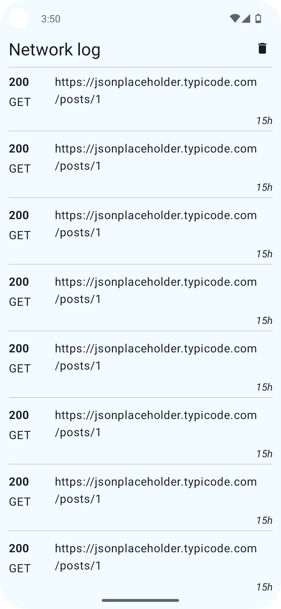
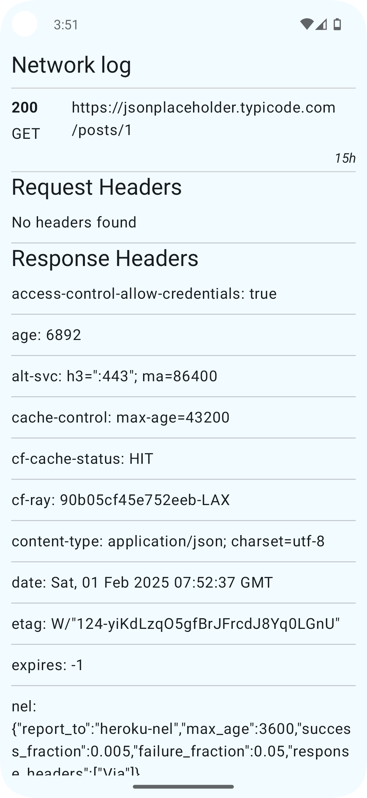
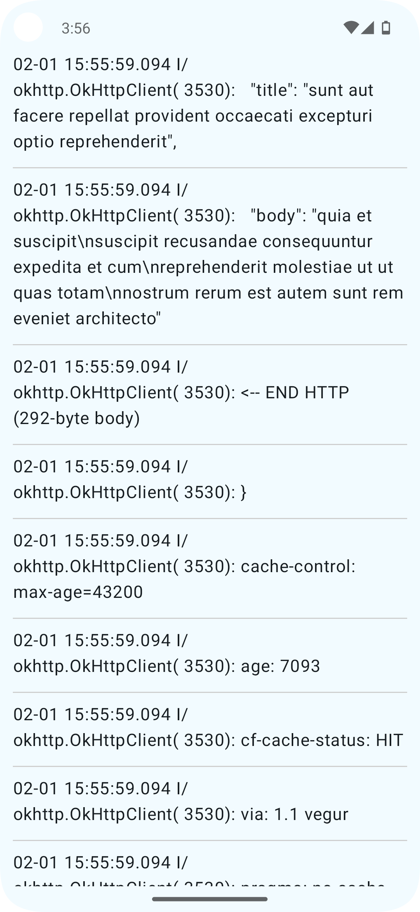
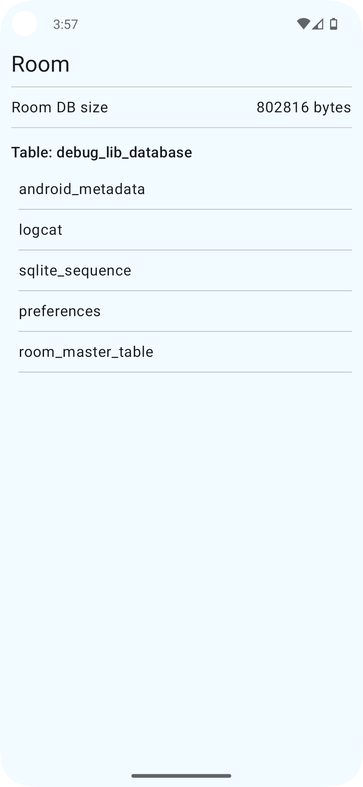
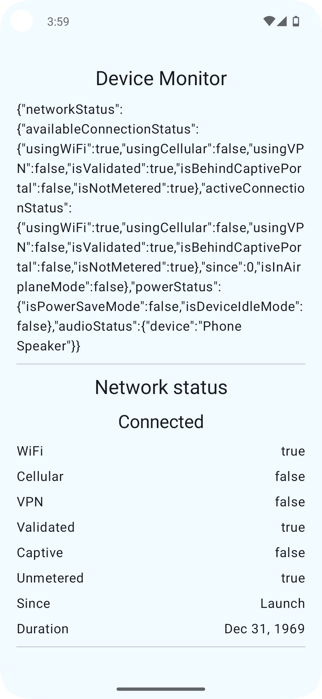
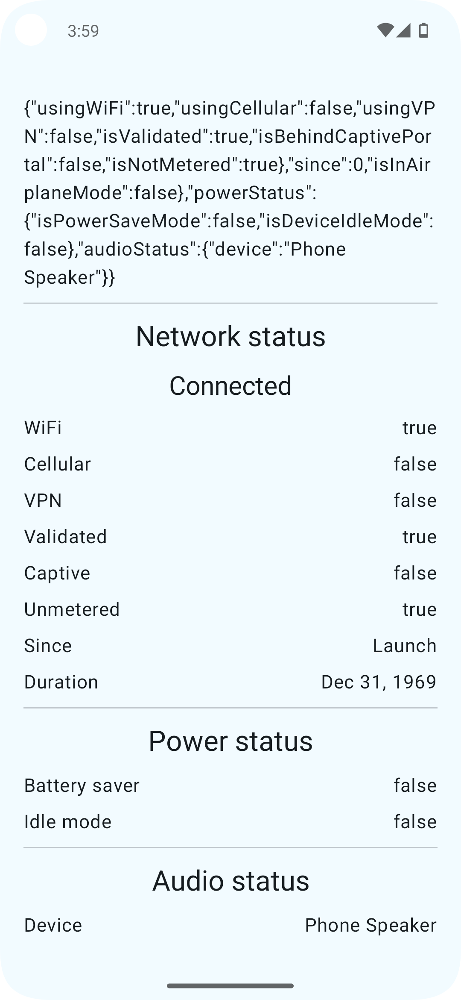
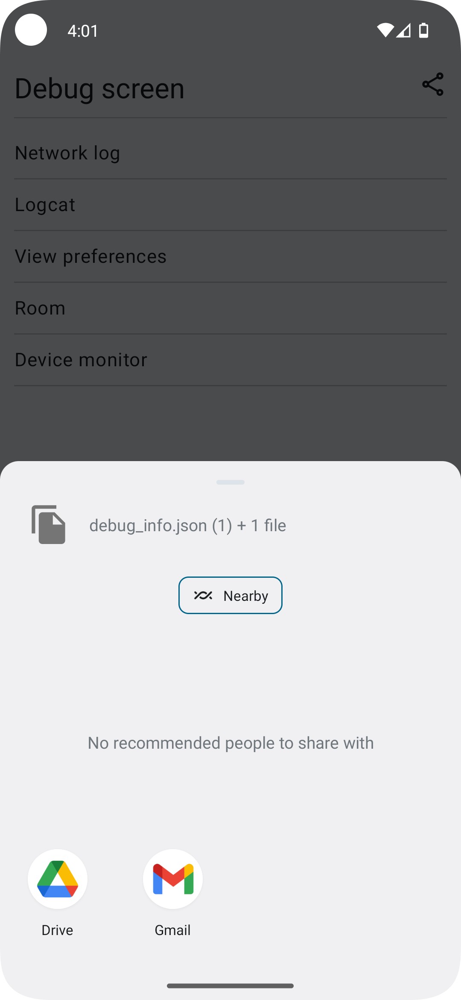

# Introduction

This library provides an on-device solution for obtaining and displaying debug information 
related to the app, with options to export data as needed. It is enabled exclusively for 
DEBUG builds, while a no-op version is available for RELEASE variants. Designed to assist 
both developers and QA teams, it streamlines issue reporting and diagnostics during 
development and testing. A key advantage of this library is that all debugging insights 
are accessible directly on the device, eliminating the need for external tools.

# Features

The debug information collected and reported include:

- Network traffic
- Logcat output
- Summary of Room Database storage
- Shared preferences
- Status of network, power, and audio systems

## Network traffic

The library uses an ASM based gradle plugin to intercept OkHTTP traffic (no need to add Interceptors manually).

## Logcat

## Room Database

## Device Monitor

## Share the collected information

